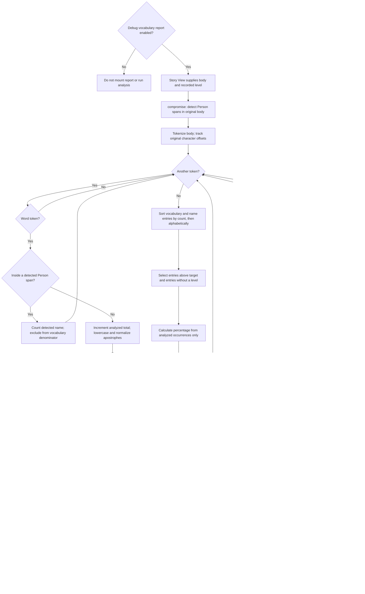
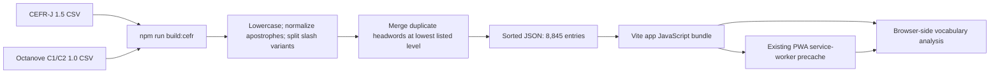

# How CEFR vocabulary validation works

The app estimates how much of a story's vocabulary is above its recorded CEFR level. Enable **Settings → Debugging → Show approximate vocabulary difficulty (debugging)** to show the advisory report at the bottom of Story View, after the story and any unknown-word glossary. This setting is **off by default**, including for existing settings without the new field. It persists locally and applies independently of fixture visibility to both saved stories and debugging fixtures. When disabled, the report component is not mounted and vocabulary analysis does not run. The validator does not ask an LLM to evaluate the story, prevent saving, or certify the story's overall CEFR level.

The main entry point is [`analyzeVocabulary(body, target)`](../src/lib/cefr.ts). Its two inputs are the story body and a target such as `A1` or `B2`. Its output contains original and analyzed word counts, detected names excluded from analysis, above-level and unlisted entries, occurrence counts, and an above-level percentage. Name detection uses [compromise](https://github.com/spencermountain/compromise); morphology uses [wink-lemmatizer](https://github.com/winkjs/wink-lemmatizer). Both run locally in the browser.

## 1. Where the story's target level comes from

[`NewStory.tsx`](../src/pages/NewStory.tsx) reads the Settings level and passes it to the story-generation request. After generation succeeds, it records that same level in `Story.level`, saves the story, and navigates to Story View. Generation still requires the configured provider and API key; vocabulary analysis does not.

[`storage.ts`](../src/lib/storage.ts) stores stories and settings in browser `localStorage`. [`StoryView.tsx`](../src/pages/StoryView.tsx) loads the saved story and, when `showVocabularyReport` is enabled, renders [`VocabularyReport`](../src/components/VocabularyReport.tsx) with `story.body` and `story.level`. This path handles both a newly generated story and a story reopened later.

Changing Settings does not change the target of an existing story. For example, a story generated at A1 continues to be checked against A1 after Settings changes to C2. The analyzer examines the body, excluding the title, theme, and saved word marks.

The report is computed when rendered and memoized by body and level with React `useMemo`. It is not stored as a separate report in `localStorage`. Consequently, reopening a story with an updated app can produce a different report if the bundled dataset or normalization rules have changed.

## 2. Runtime flowchart



There are no remote validation requests anywhere in this flow. The analyzer imports the JSON vocabulary directly into the app bundle.

## 3. What counts as a word occurrence

The analyzer reuses [`tokenize.ts`](../src/lib/tokenize.ts), which recognizes this pattern:

```javascript
/(\p{L}+(?:['’]\p{L}+)*)/gu
```

`\p{L}` recognizes Unicode letters. A word can contain straight or curly apostrophes when letters follow the apostrophe. Everything between word matches becomes an `other` token and is skipped by the analyzer.

| Input | Analyzed word tokens | Consequence |
| --- | --- | --- |
| `Cat, cat!` | `Cat`, `cat` | Two occurrences, one normalized entry. |
| `she’s` | `she’s` | One occurrence, even though contraction lookup uses components. |
| `cat-dog` | `cat`, `dog` | Hyphens separate words. |
| `123 ...` | None | Numbers and punctuation do not increase the total. |
| `abc123def` | `abc`, `def` | Digits separate letter sequences. |
| `dogs'` | `dogs` | The trailing apostrophe is punctuation. |
| `你好` | `你好` | Unicode letters count, but this English dataset normally leaves them unlisted. |

The analyzer lowercases each word and replaces curly `’` with straight `'`. Thus `CONCUR` and `concur` share an entry, as do `she’s` and `she's`.

### Name detection before vocabulary lookup

The analyzer calls `nlp(body).match('#Person').json({ offset: true })` using compromise on the original text, before lowercasing. Its matches supply character spans. The shared tokenizer preserves every character through word and other tokens, so accumulating token lengths gives offsets into the same body. A word wholly inside a detected span is grouped in `names`, increments `nameCount`, and is skipped by vocabulary lookup. This includes recognized possessives such as `Sarah's` and `Sarah’s`, and detected names already present in the CEFR lexicon.

Exclusion is per occurrence, rather than a global lowercase blacklist. In `Mark said hello. Please mark the paper.`, the detected name is excluded while the ordinary verb `mark` is still analyzed. Names are shown under **Detected names**, with their excluded occurrence counts; they are not assigned a CEFR level.

This is automatic, approximate **person-name detection**, not general named-entity recognition. It does not automatically exclude places, organizations, or every capitalized word. It can miss names or incorrectly tag common words. In representative excerpts of the dog-adoption story, compromise recognizes Sarah but misses Leo and the pet Max. Undetected names continue through normal lookup: Leo can remain unlisted while Max matches the existing A2 entry. There is no character metadata, custom name dictionary, manual override, or extra LLM call in this implementation. Reopening a story reruns detection with the installed package version.

## 4. Contractions and inflections

The private `expand` and `lemma` functions in [`cefr.ts`](../src/lib/cefr.ts) combine explicit contraction handling with wink-lemmatizer. Morphology does not use contextual part-of-speech or word-sense disambiguation; compromise is used only for person-name spans.

### Contractions are expanded before component lookup

The explicit contraction map includes `can't → can + not`, `won't → will + not`, `shan't → shall + not`, `ain't → be + not`, `let's → let + us`, and `cannot → can + not`.

Other supported forms follow suffix rules:

| Form | Lookup components |
| --- | --- |
| `didn't` | `did` and `not`; irregular lookup can resolve `did` to `do`. |
| `I'm` | `i` and `be`. |
| `you're` | `you` and `be`. |
| `we've` | `we` and `have`. |
| `it'll` | `it` and `will`. |
| `they'd` | `they` and `would`. |
| `she's` | `she` and `be`. |

Pronoun and related forms ending in `'s` are recognized for `he`, `she`, `it`, `that`, `there`, `here`, `what`, `who`, `where`, and `how`. Other `'s` forms are passed through to possessive lookup.

Ambiguous `'s` is approximated as `be` rather than distinguishing *is* from *has*. Ambiguous `'d` is approximated as `would` rather than distinguishing *would* from *had*. Their relevant lemmas are A1 in this dataset, but the analyzer does not perform grammatical disambiguation.

A contraction contributes **one original occurrence**. Its assigned level is the highest level among its resolved components. If even one component cannot be resolved, the entire original occurrence is unlisted. For example, `zorblax'll` is unlisted even though `will` is known to the dataset.

### Each component is resolved in this order

1. **Exact entry:** use the normalized component if it exists in the dataset.
2. **Reviewed spelling alias:** try the explicit alias table. Currently `tranquillity → tranquility` reuses the existing C1 entry while preserving the original spelling in the report. Exact entries still win if the dataset later lists the original spelling.
3. **Possessive base:** remove a trailing `'s` and try the remaining word directly.
4. **Pronoun alias:** map `others → other`, because wink-lemmatizer handles verbs, nouns, and adjectives rather than this plural pronoun.
5. **wink-lemmatizer candidates:** try `verb(base)`, then `noun(base)`, then `adjective(base)`. Select the first result actually present in the CEFR lexicon. The package replaces the previous manual irregular map and suffix heuristics.

Examples include `sat → sit`, `drank → drink`, `drove → drive`, `studies → study`, `stopped → stop`, `knives → knife`, and `happier → happy`. A form can have different lemmas depending on part of speech; the fixed candidate order is an approximation rather than contextual disambiguation.

**Exact lookup takes precedence over lemmatization.** The dataset lists `running` and `walking` at A2, so those exact entries remain A2 even though `run` and `walk` are A1. Similarly, `abandoned` remains the listed B2 entry rather than reducing to B1 `abandon`.

Neither npm package supplies CEFR levels. A successful morphological reduction does not establish a level unless the resulting lemma exists in our bundled profiles. For example, `wagged → wag` still remains unlisted because `wag` is absent. `woof` also remains unlisted. No frequency-estimated supplemental CEFR dataset is bundled.

The dependencies are [compromise](https://github.com/spencermountain/compromise) and [wink-lemmatizer](https://github.com/winkjs/wink-lemmatizer), both MIT-licensed. [`package.json`](../package.json) declares their version ranges and [`package-lock.json`](../package-lock.json) records installed versions. [`src/wink-lemmatizer.d.ts`](../src/wink-lemmatizer.d.ts) declares the three string-to-string methods used by the app because the package does not ship TypeScript declarations.

### Fixture coverage audit

The built-in articles originally had 23 unlisted occurrences across 21 distinct words. The current wink-lemmatizer flow resolves the same five irregular-form occurrences; the spelling alias resolves one. The pronoun alias preserves classification of `others`. No person names are detected in these garden articles, and the articles themselves are unchanged.

| Article | Before | After | Remaining unlisted words |
| --- | ---: | ---: | --- |
| A1 | 0 | 0 | None |
| A2 | 1 | 0 | None |
| B1 | 3 | 0 | None |
| B2 | 2 | 1 | `unused` |
| C1 | 4 | 4 | `incidental`, `measurable`, `promotional`, `solely` |
| C2 | 13 | 12 | `allocation`, `belies`, `collective`, `communal`, `countable`, `discerning`, `eclipse`, `inadequacy`, `ownership`, `transience`, `uncomplicated`, `unequal` |

The remaining 17 words are coverage gaps, not spelling variants resolved by the current profiles. Some have listed relatives, but a derivation does not establish the original word's level. For example, `collect` is A1, while this does not establish a level for `collective`. `belies` could be reduced to `belie`, but `belie` itself is absent, so fixing its morphology alone would not classify it.

To add supplemental entries, require an explicit level for the actual word, the source URL and version, and terms permitting bundled redistribution. Keep such entries separate from the original CSVs and merge them through the dataset build script with a documented conflict policy. Do not assign a level solely from an article's target, an LLM guess, or a related word.

Source review on October 1, 2026 identified two useful references but did not establish a redistributable supplement for these words:

- [British Council Word Family Framework](https://www.teachingenglish.org.uk/professional-development/teachers/planning-lessons-and-courses/articles/word-family-framework) explicitly distinguishes levels within word families and includes an X category for entries outside the scale or lacking sufficient evidence. Its public description offers lookup/download, but that description alone does not establish permission to redistribute its data in this app. An X entry must remain unclassified.
- [English Vocabulary Profile](https://englishprofile.org/?menu=english-vocabulary-profile) is a reference for word and sense levels; its [contact page](https://englishprofile.org/?menu=contact-us) states that the profile data is not licensed for commercial purposes. Public lookup availability is not a verified open-data redistribution license.

No supplemental levels have been bundled. Regression tests preserve the exact remaining unlisted lists so future coverage changes are reviewable.

## 5. Cumulative levels and entry classification

[`types.ts`](../src/types.ts) defines the ordering:

```text
A1 < A2 < B1 < B2 < C1 < C2
```

An entry is above level only when its assigned level has a greater index than the target. This makes coverage cumulative: A2 accepts A1 and A2; B1 accepts A1, A2, and B1; C2 accepts every listed level.

A word occurrence has one of four interpretations:

| Result | Condition | Report behavior |
| --- | --- | --- |
| Detected name | Original occurrence falls inside a compromise Person span. | Shown separately; excluded from both numerator and denominator. |
| Within level | Assigned level is equal to or below target. | Included in total; omitted from flagged lists. |
| Above level | Assigned level is higher than target. | Included in the above-level list and numerator. |
| Unlisted | At least one required component has no matched lemma. | Included in a separate list and total, but excluded from the numerator. |

“Unlisted” does not mean “advanced,” “easy,” or “incorrect.” The word may be an undetected name, specialized term, unsupported inflection, non-English text, or simply an omission in the profiles.

## 6. Counts, grouping, and percentage

Vocabulary entries and detected names are grouped separately by their **normalized original word**, not by lemma. The same spelling can appear in both groups when occurrences receive different contextual tags. `cat` and `cats` remain separate display entries even if both match `cat`. `concur` and `CONCUR` share one vocabulary entry because their normalized originals are identical. This grouping is independent of the story's known/unknown word marks.

For a repeated normalized word, lookup runs once and subsequent occurrences increment its count. Display entries are sorted by descending count, then alphabetically using `localeCompare`.

The report calculates:

```text
wordCount     = every original word occurrence
nameCount     = word occurrences inside detected Person spans
total         = wordCount - nameCount
aboveCount    = sum of counts for above-level entries
unlistedCount = sum of counts for unlisted entries
abovePercent  = aboveCount / total × 100
```

For zero analyzed vocabulary occurrences, including a body consisting only of detected names, `abovePercent` is zero; the UI displays “No vocabulary occurrences to analyze.” The excluded-name list remains available. Otherwise, the UI formats the percentage to one decimal place using `toFixed(1)`.

Detected names are excluded from the denominator. Unlisted occurrences stay in the denominator without being treated as within level. This choice means many unlisted words can lower the displayed percentage. Always interpret the percentage alongside the unlisted and excluded-name counts.

### Worked example

The saved [test fixture](../tests/fixtures/cefr-stories.json) contains this A1 story body:

```text
Cats walked. She’s happy. Concur, CONCUR! Ephemeral Zorblax.
```

| Normalized original | Count | Lookup | Assigned level | Against A1 |
| --- | ---: | --- | --- | --- |
| `cats` | 1 | `cat` | A1 | Within level |
| `walked` | 1 | `walk` | A1 | Within level |
| `she's` | 1 | `she + be` | A1 | Within level |
| `happy` | 1 | `happy` | A1 | Within level |
| `concur` | 2 | `concur` | C1 | Above level |
| `ephemeral` | 1 | `ephemeral` | C2 | Above level |
| `zorblax` | 1 | No match | Unlisted | Separate result |

No names are detected in this fixture. There are eight original and analyzed word occurrences, three above-level occurrences, and one unlisted occurrence. The percentage is `3 / 8 × 100 = 37.5%`. The above-level list has **two distinct words**, even though its occurrence count is three. Expanding `she's` does not increase the denominator from eight to nine.

The fixture's Settings level is C2, which deliberately differs from the story's recorded A1 level. The expected report remains A1.

## 7. Dataset preparation and offline behavior

The runtime vocabulary comes from two pinned source files:

- [CEFR-J Vocabulary Profile 1.5](../data/cefr/cefrj-vocabulary-profile-1.5.csv), covering A1–B2.
- [Octanove Vocabulary Profile C1/C2 1.0](../data/cefr/octanove-vocabulary-profile-c1c2-1.0.csv), covering C1–C2.

[`build-cefr.mjs`](../scripts/build-cefr.mjs) combines them into the checked-in [`src/data/cefr.json`](../src/data/cefr.json):



The script reads only local files. It parses quoted commas and escaped quotes in the source CSVs; its parser assumes no multiline CSV fields. It validates level values, normalizes headwords, splits slash alternatives, and retains the lowest listed level when the same word appears across parts of speech or profiles. It then sorts keys and writes JSON.

For example, a word appearing at B2 in one profile and C1 in another is bundled as B2. This policy prevents a higher-level sense from overriding a lower-level entry, but can understate difficulty when the story uses the harder sense.

The CSVs and generated JSON contain some multiword expressions. Runtime tokenization processes individual words and does not match those phrases as units. Parts of speech and notes are not retained in the JSON; the runtime map contains only headword-to-level pairs.

`npm run build:cefr` is an explicit maintenance command. It is not automatically invoked by `npm run build` or `npm run dev`; both use the checked-in JSON. After editing a source profile, rebuild and commit the JSON together with the source change.

[`vite.config.ts`](../vite.config.ts) includes app JavaScript in the PWA precache. Because vocabulary, compromise, and wink-lemmatizer are imported into that JavaScript, no separate runtime dataset fetch, NLP model download, or server request is needed. Once the production app has been loaded and cached successfully, saved-story reports work without the origin server. First loading the app still requires obtaining its assets. Story generation remains a separate online operation.

Attribution, the pinned upstream commit, original source checksums, and dataset permissions are documented in the [dataset README](../data/cefr/README.md). The [upstream terms](../data/cefr/UPSTREAM-README.md) and [CC BY-SA 4.0 legal code](../data/cefr/CC-BY-SA-4.0.txt) are bundled too. The combined JSON is distributed under CC BY-SA 4.0; dataset permissions are separate from the code license.

## 8. Result shape and UI responsibilities

`analyzeVocabulary` returns these fields:

| Field | Meaning |
| --- | --- |
| `target` | Recorded CEFR level used for comparison. |
| `wordCount` | All original word occurrences before name exclusion. |
| `nameCount` | Word occurrences excluded as detected person names. |
| `names` | Sorted excluded-name entries without assigned levels. |
| `total` | Analyzed occurrences: `wordCount - nameCount`. |
| `aboveLevel` | Sorted above-level entries. |
| `unlisted` | Sorted entries without an assigned level. |
| `aboveCount` | Occurrences belonging to above-level entries. |
| `unlistedCount` | Occurrences belonging to unlisted entries. |
| `abovePercent` | Unrounded percentage, or zero for empty input. |

Each entry has `word`, `count`, optional `level`, and `lemmas`. Unlisted entries can still contain partially resolved lemmas, but have no level. The UI shows matched lemmas only for classified entries where they differ from the original word.

[`VocabularyReport.tsx`](../src/components/VocabularyReport.tsx) handles memoization, display rounding, expandable word lists, and the calculation/dataset explanation. [`StoryView.tsx`](../src/pages/StoryView.tsx) determines placement and passes the saved story inputs. Neither component changes the story body or its word marks when producing the report.

## 9. Verification and maintenance

### Built-in articles for debugging

Enable **Settings → Debugging → Show CEFR fixture articles in My Stories** to display six original articles about a community garden, one labeled for each CEFR level. Also enable **Show approximate vocabulary difficulty (debugging)** to inspect their reports. Both switches are off by default, including for existing saved Settings that predate the options. They persist independently, locally, and need no API key.

[`debug-fixtures.ts`](../src/lib/debug-fixtures.ts) contains the articles and stable IDs. These are illustrative targets for inspecting the report, not certified examples guaranteed to contain only vocabulary within their labeled level. Increasing grammatical complexity is also intentionally present, although the validator assesses vocabulary only.

[`storage.ts`](../src/lib/storage.ts) exposes `loadVisibleStories()` to combine saved stories with enabled fixtures. `loadStories()` continues to return only actual saved stories. Fixture text is bundled rather than inserted into saved-story storage. Marking a fixture word or saving its definition writes only its reading state to `era.v1.debug-fixtures`, separate from `era.v1.stories`. Turning the option off hides the fixtures, including direct fixture routes, but keeps saved stories and fixture reading state. Re-enabling restores that state.

[`MyStories.tsx`](../src/pages/MyStories.tsx) lists the enabled articles with a “Debug fixture” badge, and [`StoryView.tsx`](../src/pages/StoryView.tsx) identifies them while displaying the ordinary reading controls and vocabulary report. [`Settings.tsx`](../src/pages/Settings.tsx) provides the switch. [`debug-fixtures.test.mjs`](../tests/debug-fixtures.test.mjs) verifies the default, legacy-settings behavior, visibility, independent persistence, and preservation of saved stories.

### Automated checks

The focused tests live in [`tests/cefr.test.mjs`](../tests/cefr.test.mjs). Run them with Node.js 22.18 or newer, which supports the native TypeScript stripping used to import the analyzer:

```bash
npm run test:cefr
```

They cover representative A1–C2 entries and cumulative thresholds, repeated-word percentages, regular and irregular inflections, exact-entry precedence, straight/curly contractions, detected names and possessives, name exclusion from the denominator, occurrence-specific name handling, punctuation, unlisted and non-Latin words, empty input, duplicate senses, and the recorded-level fixture.

Additional existing checks are:

```bash
npm run lint
npm run build
git diff --check
```

When changing the dataset, also run `npm run build:cefr` and inspect the resulting JSON diff. When changing normalization or counting, update the example expectations and tests if behavior intentionally changes. When changing presentation or bundling, use the [browser fixture and offline verification steps](../data/cefr/README.md#reproducible-verification).

The validator does not inspect grammatical complexity, idioms, word senses, reader familiarity, or overall comprehension. There is no pass/fail cutoff, automatic rewrite, or automatic regeneration. The practical purpose is to show which listed words may be harder than the selected level and where the dataset cannot provide an answer.

## Related files

| File | Role |
| --- | --- |
| [`src/lib/cefr.ts`](../src/lib/cefr.ts) | Person-span detection, contraction expansion, wink lemma matching, classification, and counting. |
| [`src/wink-lemmatizer.d.ts`](../src/wink-lemmatizer.d.ts) | Local TypeScript declarations for the lemmatizer methods. |
| [`src/lib/tokenize.ts`](../src/lib/tokenize.ts) | Shared word boundaries and punctuation handling. |
| [`src/types.ts`](../src/types.ts) | CEFR ordering and story/settings types. |
| [`src/components/VocabularyReport.tsx`](../src/components/VocabularyReport.tsx) | Report display and memoization. |
| [`src/pages/StoryView.tsx`](../src/pages/StoryView.tsx) | Saved story loading and report placement. |
| [`src/pages/NewStory.tsx`](../src/pages/NewStory.tsx) | Capture the generation level in the saved story. |
| [`src/lib/storage.ts`](../src/lib/storage.ts) | Browser-local story persistence. |
| [`scripts/build-cefr.mjs`](../scripts/build-cefr.mjs) | Reproducible conversion from source CSVs to runtime JSON. |
| [`src/data/cefr.json`](../src/data/cefr.json) | Bundled vocabulary map. |
| [`data/cefr/README.md`](../data/cefr/README.md) | Source versions, permissions, limitations, and browser reproduction steps. |
| [`tests/cefr.test.mjs`](../tests/cefr.test.mjs) | Validator behavior tests. |
| [`tests/fixtures/cefr-stories.json`](../tests/fixtures/cefr-stories.json) | Disposable story and Settings fixture. |
| [`src/lib/debug-fixtures.ts`](../src/lib/debug-fixtures.ts) | Six bundled articles for the optional debugging view. |
| [`src/pages/MyStories.tsx`](../src/pages/MyStories.tsx) | Lists saved stories and enabled debugging fixtures. |
| [`src/pages/Settings.tsx`](../src/pages/Settings.tsx) | Off-by-default fixture visibility switch. |
| [`tests/debug-fixtures.test.mjs`](../tests/debug-fixtures.test.mjs) | Fixture visibility and separate reading-state persistence tests. |
| [`vite.config.ts`](../vite.config.ts) | Production asset bundling and PWA precache configuration. |
| [`package.json`](../package.json) | Dataset rebuild, test, build, and development commands. |
