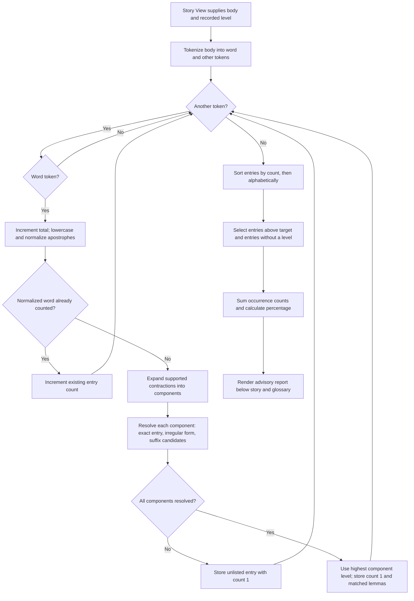
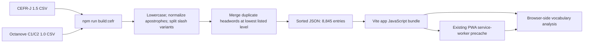

# How CEFR vocabulary validation works

The app estimates how much of a story's vocabulary is above its recorded CEFR level. It compares words with a bundled vocabulary list and shows an advisory report at the bottom of Story View, after the story and any unknown-word glossary. It does not ask an LLM to evaluate the story, prevent saving, or certify the story's overall CEFR level.

The main entry point is [`analyzeVocabulary(body, target)`](../src/lib/cefr.ts). Its two inputs are the story body and a target such as `A1` or `B2`. Its output contains the total number of word occurrences, above-level and unlisted entries, occurrence counts, and an above-level percentage.

## 1. Where the story's target level comes from

[`NewStory.tsx`](../src/pages/NewStory.tsx) reads the Settings level and passes it to the story-generation request. After generation succeeds, it records that same level in `Story.level`, saves the story, and navigates to Story View. Generation still requires the configured provider and API key; vocabulary analysis does not.

[`storage.ts`](../src/lib/storage.ts) stores stories in browser `localStorage`. [`StoryView.tsx`](../src/pages/StoryView.tsx) loads the saved story and renders [`VocabularyReport`](../src/components/VocabularyReport.tsx) with `story.body` and `story.level`. This path handles both a newly generated story and a story reopened later.

Changing Settings does not change the target of an existing story. For example, a story generated at A1 continues to be checked against A1 after Settings changes to C2. The analyzer examines the body, excluding the title, theme, and saved word marks.

The report is computed when rendered and memoized by body and level with React `useMemo`. It is not stored as a separate report in `localStorage`. Consequently, reopening a story with an updated app can produce a different report if the bundled dataset or normalization rules have changed.

## 2. Runtime flowchart



There are no remote validation requests anywhere in this flow. The analyzer imports the JSON vocabulary directly into the app bundle.

## 3. What counts as a word occurrence

The analyzer reuses [`tokenize.ts`](../src/lib/tokenize.ts), which recognizes this pattern:

```javascript
/(\p{L}+(?:['’]\p{L}+)*)/gu
```

`\p{L}` recognizes Unicode letters. A word can contain straight or curly apostrophes when letters follow the apostrophe. Everything between word matches becomes an `other` token and is skipped by the analyzer.

| Input | Analyzed word tokens | Consequence |
| --- | --- | --- |
| `Cat, cat!` | `Cat`, `cat` | Two occurrences, one normalized entry. |
| `she’s` | `she’s` | One occurrence, even though contraction lookup uses components. |
| `cat-dog` | `cat`, `dog` | Hyphens separate words. |
| `123 ...` | None | Numbers and punctuation do not increase the total. |
| `abc123def` | `abc`, `def` | Digits separate letter sequences. |
| `dogs'` | `dogs` | The trailing apostrophe is punctuation. |
| `你好` | `你好` | Unicode letters count, but this English dataset normally leaves them unlisted. |

The analyzer lowercases each word and replaces curly `’` with straight `'`. Thus `CONCUR` and `concur` share an entry, as do `she’s` and `she's`.

Names are treated exactly like other words. Capitalization does not exclude a name, because sentence-initial common words are also capitalized. A name found in the dataset receives that entry's level; an absent name is unlisted. There is no named-entity detector or automatic name exemption.

## 4. Contractions and inflections

The private `expand` and `lemma` functions in [`cefr.ts`](../src/lib/cefr.ts) implement deterministic lookup rules. They do not infer grammar or word sense from surrounding text.

### Contractions are expanded before component lookup

The explicit contraction map includes `can't → can + not`, `won't → will + not`, `shan't → shall + not`, `ain't → be + not`, `let's → let + us`, and `cannot → can + not`.

Other supported forms follow suffix rules:

| Form | Lookup components |
| --- | --- |
| `didn't` | `did` and `not`; irregular lookup can resolve `did` to `do`. |
| `I'm` | `i` and `be`. |
| `you're` | `you` and `be`. |
| `we've` | `we` and `have`. |
| `it'll` | `it` and `will`. |
| `they'd` | `they` and `would`. |
| `she's` | `she` and `be`. |

Pronoun and related forms ending in `'s` are recognized for `he`, `she`, `it`, `that`, `there`, `here`, `what`, `who`, `where`, and `how`. Other `'s` forms are passed through to possessive lookup.

Ambiguous `'s` is approximated as `be` rather than distinguishing *is* from *has*. Ambiguous `'d` is approximated as `would` rather than distinguishing *would* from *had*. Their relevant lemmas are A1 in this dataset, but the analyzer does not perform grammatical disambiguation.

A contraction contributes **one original occurrence**. Its assigned level is the highest level among its resolved components. If even one component cannot be resolved, the entire original occurrence is unlisted. For example, `zorblax'll` is unlisted even though `will` is known to the dataset.

### Each component is resolved in this order

1. **Exact entry:** use the normalized component if it exists in the dataset.
2. **Explicit irregular form:** try the hand-maintained map, such as `went → go`, `children → child`, or `better → good`, and require the mapped lemma to exist.
3. **Suffix candidates:** construct possible lemmas and use the first candidate present in the dataset.

The suffix rules cover possessive `'s`, plural `ies`, past `ied`, `ves`, selected plural `es` endings, ordinary plural `s`, and the suffixes `ing`, `ed`, `er`, and `est`. Candidates include removing the suffix, restoring final `e`, removing a doubled final letter, and changing final `i` back to `y` where applicable.

Examples include `studies → study`, `walked → walk`, `stopped → stop`, `knives → knife`, and `dog's → dog`. Candidate ordering matters: the analyzer selects the first matching candidate, not the lowest-level candidate among all possible lemmas.

**Exact lookup takes precedence over stemming.** The dataset lists `running` and `walking` at A2, so those exact entries remain A2 even though the verbs `run` and `walk` are A1. Similarly, `abandoned` is a listed B2 entry and is not reduced to the B1 verb `abandon`.

These rules are approximate. They can miss unsupported irregular forms, select an unrelated lemma, or treat a misspelling as an inflection. The output should be read as a vocabulary estimate with documented coverage gaps.

## 5. Cumulative levels and entry classification

[`types.ts`](../src/types.ts) defines the ordering:

```text
A1 < A2 < B1 < B2 < C1 < C2
```

An entry is above level only when its assigned level has a greater index than the target. This makes coverage cumulative: A2 accepts A1 and A2; B1 accepts A1, A2, and B1; C2 accepts every listed level.

An entry has one of three interpretations:

| Result | Condition | Report behavior |
| --- | --- | --- |
| Within level | Assigned level is equal to or below target. | Included in total; omitted from flagged lists. |
| Above level | Assigned level is higher than target. | Included in the above-level list and numerator. |
| Unlisted | At least one required component has no matched lemma. | Included in a separate list and total, but excluded from the numerator. |

“Unlisted” does not mean “advanced,” “easy,” or “incorrect.” The word may be a name, specialized term, unsupported inflection, non-English text, or simply an omission in the profiles.

## 6. Counts, grouping, and percentage

Entries are grouped by their **normalized original word**, not by lemma. `cat` and `cats` remain separate display entries even if both match `cat`. `concur` and `CONCUR` share one entry because their normalized originals are identical. This grouping is independent of the story's known/unknown word marks.

For a repeated normalized word, lookup runs once and subsequent occurrences increment its count. Display entries are sorted by descending count, then alphabetically using `localeCompare`.

The report calculates:

```text
total         = every original word occurrence
aboveCount    = sum of counts for above-level entries
unlistedCount = sum of counts for unlisted entries
abovePercent  = aboveCount / total × 100
```

For zero word occurrences, `abovePercent` is zero; the UI displays “No word occurrences to analyze.” Otherwise, the UI formats the percentage to one decimal place using `toFixed(1)`.

Unlisted occurrences stay in the denominator without being treated as within level. This choice means many unlisted words can lower the displayed percentage. Always interpret the percentage alongside the unlisted count.

### Worked example

The saved [test fixture](../tests/fixtures/cefr-stories.json) contains this A1 story body:

```text
Cats walked. She’s happy. Concur, CONCUR! Ephemeral Zorblax.
```

| Normalized original | Count | Lookup | Assigned level | Against A1 |
| --- | ---: | --- | --- | --- |
| `cats` | 1 | `cat` | A1 | Within level |
| `walked` | 1 | `walk` | A1 | Within level |
| `she's` | 1 | `she + be` | A1 | Within level |
| `happy` | 1 | `happy` | A1 | Within level |
| `concur` | 2 | `concur` | C1 | Above level |
| `ephemeral` | 1 | `ephemeral` | C2 | Above level |
| `zorblax` | 1 | No match | Unlisted | Separate result |

There are eight original word occurrences, three above-level occurrences, and one unlisted occurrence. The percentage is `3 / 8 × 100 = 37.5%`. The above-level list has **two distinct words**, even though its occurrence count is three. Expanding `she's` does not increase the denominator from eight to nine.

The fixture's Settings level is C2, which deliberately differs from the story's recorded A1 level. The expected report remains A1.

## 7. Dataset preparation and offline behavior

The runtime vocabulary comes from two pinned source files:

- [CEFR-J Vocabulary Profile 1.5](../data/cefr/cefrj-vocabulary-profile-1.5.csv), covering A1–B2.
- [Octanove Vocabulary Profile C1/C2 1.0](../data/cefr/octanove-vocabulary-profile-c1c2-1.0.csv), covering C1–C2.

[`build-cefr.mjs`](../scripts/build-cefr.mjs) combines them into the checked-in [`src/data/cefr.json`](../src/data/cefr.json):



The script reads only local files. It parses quoted commas and escaped quotes in the source CSVs; its parser assumes no multiline CSV fields. It validates level values, normalizes headwords, splits slash alternatives, and retains the lowest listed level when the same word appears across parts of speech or profiles. It then sorts keys and writes JSON.

For example, a word appearing at B2 in one profile and C1 in another is bundled as B2. This policy prevents a higher-level sense from overriding a lower-level entry, but can understate difficulty when the story uses the harder sense.

The CSVs and generated JSON contain some multiword expressions. Runtime tokenization processes individual words and does not match those phrases as units. Parts of speech and notes are not retained in the JSON; the runtime map contains only headword-to-level pairs.

`npm run build:cefr` is an explicit maintenance command. It is not automatically invoked by `npm run build` or `npm run dev`; both use the checked-in JSON. After editing a source profile, rebuild and commit the JSON together with the source change.

[`vite.config.ts`](../vite.config.ts) includes app JavaScript in the PWA precache. Because vocabulary is imported into that JavaScript, no separate runtime CSV or JSON fetch is needed. Once the production app has been loaded and cached successfully, saved-story reports work without the origin server. First loading the app still requires obtaining its assets. Story generation remains a separate online operation.

Attribution, the pinned upstream commit, original source checksums, and dataset permissions are documented in the [dataset README](../data/cefr/README.md). The [upstream terms](../data/cefr/UPSTREAM-README.md) and [CC BY-SA 4.0 legal code](../data/cefr/CC-BY-SA-4.0.txt) are bundled too. The combined JSON is distributed under CC BY-SA 4.0; dataset permissions are separate from the code license.

## 8. Result shape and UI responsibilities

`analyzeVocabulary` returns these fields:

| Field | Meaning |
| --- | --- |
| `target` | Recorded CEFR level used for comparison. |
| `total` | All original word occurrences. |
| `aboveLevel` | Sorted above-level entries. |
| `unlisted` | Sorted entries without an assigned level. |
| `aboveCount` | Occurrences belonging to above-level entries. |
| `unlistedCount` | Occurrences belonging to unlisted entries. |
| `abovePercent` | Unrounded percentage, or zero for empty input. |

Each entry has `word`, `count`, optional `level`, and `lemmas`. Unlisted entries can still contain partially resolved lemmas, but have no level. The UI shows matched lemmas only for classified entries where they differ from the original word.

[`VocabularyReport.tsx`](../src/components/VocabularyReport.tsx) handles memoization, display rounding, expandable word lists, and the calculation/dataset explanation. [`StoryView.tsx`](../src/pages/StoryView.tsx) determines placement and passes the saved story inputs. Neither component changes the story body or its word marks when producing the report.

## 9. Verification and maintenance

The focused tests live in [`tests/cefr.test.mjs`](../tests/cefr.test.mjs). Run them with Node.js 22.18 or newer, which supports the native TypeScript stripping used to import the analyzer:

```bash
npm run test:cefr
```

They cover representative A1–C2 entries and cumulative thresholds, repeated-word percentages, regular and irregular inflections, exact-entry precedence, straight/curly contractions, names, punctuation, unlisted and non-Latin words, empty input, duplicate senses, and the recorded-level fixture.

Additional existing checks are:

```bash
npm run lint
npm run build
git diff --check
```

When changing the dataset, also run `npm run build:cefr` and inspect the resulting JSON diff. When changing normalization or counting, update the example expectations and tests if behavior intentionally changes. When changing presentation or bundling, use the [browser fixture and offline verification steps](../data/cefr/README.md#reproducible-verification).

The validator does not inspect grammatical complexity, idioms, word senses, reader familiarity, or overall comprehension. There is no pass/fail cutoff, automatic rewrite, or automatic regeneration. The practical purpose is to show which listed words may be harder than the selected level and where the dataset cannot provide an answer.

## Related files

| File | Role |
| --- | --- |
| [`src/lib/cefr.ts`](../src/lib/cefr.ts) | Contraction expansion, lemma matching, classification, and counting. |
| [`src/lib/tokenize.ts`](../src/lib/tokenize.ts) | Shared word boundaries and punctuation handling. |
| [`src/types.ts`](../src/types.ts) | CEFR ordering and story/settings types. |
| [`src/components/VocabularyReport.tsx`](../src/components/VocabularyReport.tsx) | Report display and memoization. |
| [`src/pages/StoryView.tsx`](../src/pages/StoryView.tsx) | Saved story loading and report placement. |
| [`src/pages/NewStory.tsx`](../src/pages/NewStory.tsx) | Capture the generation level in the saved story. |
| [`src/lib/storage.ts`](../src/lib/storage.ts) | Browser-local story persistence. |
| [`scripts/build-cefr.mjs`](../scripts/build-cefr.mjs) | Reproducible conversion from source CSVs to runtime JSON. |
| [`src/data/cefr.json`](../src/data/cefr.json) | Bundled vocabulary map. |
| [`data/cefr/README.md`](../data/cefr/README.md) | Source versions, permissions, limitations, and browser reproduction steps. |
| [`tests/cefr.test.mjs`](../tests/cefr.test.mjs) | Validator behavior tests. |
| [`tests/fixtures/cefr-stories.json`](../tests/fixtures/cefr-stories.json) | Disposable story and Settings fixture. |
| [`vite.config.ts`](../vite.config.ts) | Production asset bundling and PWA precache configuration. |
| [`package.json`](../package.json) | Dataset rebuild, test, build, and development commands. |
